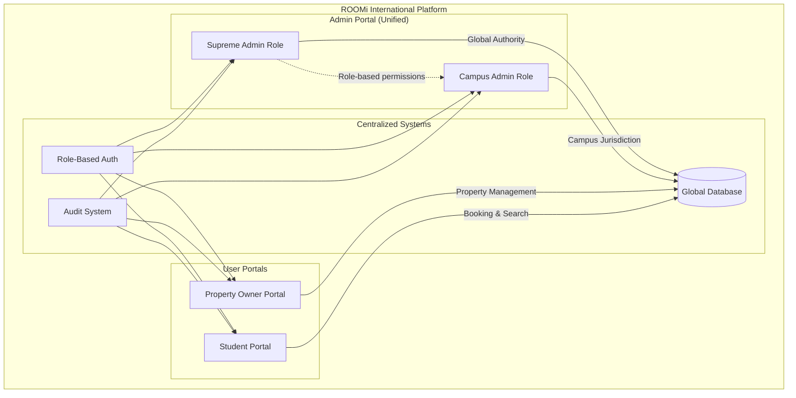

# 🏗️ ROOMi Three-Portal Architecture with Role-Based Permissions

**Date**: 2025-01-08  
**Architecture**: Simplified & Scalable  
**International Ready**: ✅ Designed for Global Expansion  

---

## 🎯 **SIMPLIFIED THREE-PORTAL SYSTEM**



---

## 🔐 **ROLE-BASED PERMISSION SYSTEM**

### **Admin Portal Roles**

```typescript
interface AdminRole {
  type: 'supreme' | 'campus';
  permissions: Permission[];
  campusJurisdiction?: string[]; // For campus admins
  countryJurisdiction?: string[]; // For international expansion
  features: AdminFeature[];
  internationalScope?: boolean;
}

interface Permission {
  resource: 'properties' | 'users' | 'bookings' | 'analytics' | 'settings';
  actions: ('create' | 'read' | 'update' | 'delete' | 'approve')[];
  scope: 'global' | 'country' | 'campus' | 'own';
  conditions?: PermissionCondition[];
}
```

### **Supreme Admin Role**
```typescript
const supremeAdminRole: AdminRole = {
  type: 'supreme',
  permissions: [
    {
      resource: 'properties',
      actions: ['create', 'read', 'update', 'delete', 'approve'],
      scope: 'global'
    },
    {
      resource: 'users',
      actions: ['create', 'read', 'update', 'delete'],
      scope: 'global'
    },
    {
      resource: 'settings',
      actions: ['create', 'read', 'update', 'delete'],
      scope: 'global'
    }
  ],
  features: ['global_analytics', 'system_configuration', 'campus_management'],
  internationalScope: true
};
```

### **Campus Admin Role**
```typescript
const campusAdminRole: AdminRole = {
  type: 'campus',
  permissions: [
    {
      resource: 'properties',
      actions: ['read', 'update', 'approve'],
      scope: 'campus',
      conditions: [{ field: 'campus_id', operator: 'in', value: 'user.campusJurisdiction' }]
    },
    {
      resource: 'users',
      actions: ['read', 'update'],
      scope: 'campus',
      conditions: [{ field: 'campus_id', operator: 'in', value: 'user.campusJurisdiction' }]
    }
  ],
  campusJurisdiction: ['upsa-accra', 'ug-legon'], // Example
  features: ['campus_analytics', 'student_verification', 'property_approval'],
  internationalScope: false
};
```

---

## 🌍 **INTERNATIONAL SCALABILITY DESIGN**

### **Country-Level Administration**
```typescript
interface CountryAdminRole extends AdminRole {
  type: 'country';
  countryJurisdiction: string[]; // ['ghana', 'nigeria', 'kenya']
  campusJurisdiction: string[]; // All campuses in their countries
  localCompliance: ComplianceRequirement[];
  localCurrency: string;
  localLanguages: string[];
}
```

### **Multi-Level Jurisdiction System**
```typescript
interface JurisdictionHierarchy {
  global: {
    supremeAdmins: string[];
    authority: 'platform_wide';
  };
  country: {
    countryAdmins: Record<string, string[]>; // country -> admin IDs
    authority: 'country_specific';
  };
  campus: {
    campusAdmins: Record<string, string[]>; // campus -> admin IDs
    authority: 'campus_specific';
  };
}
```

---

## 🔒 **ENHANCED ROW LEVEL SECURITY**

### **Role-Based Database Policies**
```sql
-- Properties access based on admin role
CREATE POLICY "Admin role-based property access" 
ON properties FOR ALL 
TO authenticated 
USING (
  CASE 
    -- Supreme Admin: Full global access
    WHEN auth.jwt() ->> 'role' = 'supreme_admin' THEN true
    
    -- Country Admin: Access to their countries
    WHEN auth.jwt() ->> 'role' = 'country_admin' THEN 
      country_code = ANY(
        SELECT jsonb_array_elements_text(
          auth.jwt() -> 'country_jurisdiction'
        )
      )
    
    -- Campus Admin: Access to their campuses
    WHEN auth.jwt() ->> 'role' = 'campus_admin' THEN 
      campus_id = ANY(
        SELECT jsonb_array_elements_text(
          auth.jwt() -> 'campus_jurisdiction'
        )
      )
    
    -- Property Owner: Own properties only
    WHEN auth.jwt() ->> 'role' = 'owner' THEN 
      owner_id = auth.uid()
    
    ELSE false
  END
);

-- Users access based on admin role
CREATE POLICY "Admin role-based user access" 
ON profiles FOR ALL 
TO authenticated 
USING (
  CASE 
    WHEN auth.jwt() ->> 'role' = 'supreme_admin' THEN true
    WHEN auth.jwt() ->> 'role' = 'country_admin' THEN 
      country_code = ANY(
        SELECT jsonb_array_elements_text(
          auth.jwt() -> 'country_jurisdiction'
        )
      )
    WHEN auth.jwt() ->> 'role' = 'campus_admin' THEN 
      campus_id = ANY(
        SELECT jsonb_array_elements_text(
          auth.jwt() -> 'campus_jurisdiction'
        )
      )
    WHEN auth.jwt() ->> 'role' IN ('owner', 'student') THEN 
      id = auth.uid()
    ELSE false
  END
);
```

---

## 🎨 **UNIFIED ADMIN PORTAL INTERFACE**

### **Role-Based Dashboard Views**
```typescript
interface AdminDashboard {
  role: AdminRole;
  widgets: DashboardWidget[];
  navigation: NavigationItem[];
  permissions: Permission[];
}

// Supreme Admin Dashboard
const supremeAdminDashboard: AdminDashboard = {
  role: supremeAdminRole,
  widgets: [
    'global_revenue_chart',
    'platform_growth_metrics',
    'country_performance_overview',
    'campus_admin_activity',
    'system_health_monitor'
  ],
  navigation: [
    'global_analytics',
    'country_management',
    'campus_management',
    'platform_settings',
    'user_management',
    'financial_overview'
  ]
};

// Campus Admin Dashboard
const campusAdminDashboard: AdminDashboard = {
  role: campusAdminRole,
  widgets: [
    'campus_revenue_chart',
    'student_satisfaction_metrics',
    'property_approval_queue',
    'campus_activity_feed',
    'local_performance_stats'
  ],
  navigation: [
    'campus_analytics',
    'property_management',
    'student_verification',
    'booking_oversight',
    'campus_settings'
  ]
};
```

### **Seamless Role Switching (for Multi-Role Users)**
```typescript
interface MultiRoleUser {
  userId: string;
  roles: AdminRole[];
  currentRole: AdminRole;
  canSwitchRoles: boolean;
}

// Example: A user who is both Country Admin and Campus Admin
const multiRoleUser: MultiRoleUser = {
  userId: 'admin-001',
  roles: [countryAdminRole, campusAdminRole],
  currentRole: countryAdminRole,
  canSwitchRoles: true
};
```

---

## 🚀 **TECHNICAL BENEFITS OF THREE-PORTAL APPROACH**

### **Reduced Complexity**
- **Single Admin Codebase**: Shared components, easier maintenance
- **Unified Authentication**: One auth system for all admin roles
- **Shared State Management**: Consistent data flow
- **Simplified Deployment**: Fewer applications to manage

### **Better User Experience**
- **Seamless Escalation**: Campus → Country → Supreme admin workflows
- **Consistent Interface**: Same UI patterns across admin levels
- **Role-Based Features**: Dynamic interface based on permissions
- **Context Switching**: Easy role switching for multi-role users

### **International Scalability**
- **Role Hierarchy**: Easy addition of new admin levels (Country, Region)
- **Permission Flexibility**: Granular control over access rights
- **Jurisdiction Management**: Clear boundaries for admin authority
- **Compliance Ready**: Built-in support for local regulations

---

## 🌍 **INTERNATIONAL EXPANSION EXAMPLE**

### **Adding Nigeria Operations**
```typescript
// 1. Create Country Admin Role for Nigeria
const nigeriaCountryAdmin: CountryAdminRole = {
  type: 'country',
  countryJurisdiction: ['nigeria'],
  campusJurisdiction: ['unilag', 'ui-ibadan', 'abu-zaria'],
  localCompliance: nigerianComplianceRules,
  localCurrency: 'NGN',
  localLanguages: ['english', 'hausa', 'yoruba', 'igbo']
};

// 2. Create Campus Admins for Nigerian Universities
const unilagCampusAdmin: AdminRole = {
  type: 'campus',
  campusJurisdiction: ['unilag'],
  countryContext: 'nigeria',
  features: ['campus_analytics', 'student_verification', 'property_approval']
};

// 3. Same Admin Portal, Different Permissions
// No new portal development needed!
```

---

## 🎯 **IMPLEMENTATION ADVANTAGES**

### **Development Efficiency**
- **Faster Development**: Single admin portal vs. multiple portals
- **Code Reuse**: Shared components across admin roles
- **Easier Testing**: One application to test thoroughly
- **Simplified Maintenance**: Single codebase for all admin functions

### **Operational Benefits**
- **Training Efficiency**: One interface to learn for all admin roles
- **Support Simplification**: Single admin system to support
- **Feature Consistency**: New features available to all admin roles
- **Bug Fixes**: Fix once, benefits all admin roles

### **Business Scalability**
- **Rapid Expansion**: Easy onboarding of new countries/campuses
- **Role Flexibility**: Can create new admin roles without new portals
- **Cost Efficiency**: Lower development and maintenance costs
- **Global Consistency**: Same admin experience worldwide

---

## ✅ **DECISION CONFIRMED: THREE-PORTAL ARCHITECTURE**

**The three-portal approach with role-based permissions is the optimal solution for ROOMi's international expansion:**

1. **Admin Portal**: Unified interface for Supreme, Country, and Campus admin roles
2. **Property Owner Portal**: Property management and analytics
3. **Student Portal**: Booking, search, and account management

**This architecture provides maximum scalability with minimum complexity, perfect for ROOMi's vision of dominating student accommodation across Africa and beyond!** 🌍🚀

---

**Ready to continue with Task 2.3: Configuration System Unification!**
